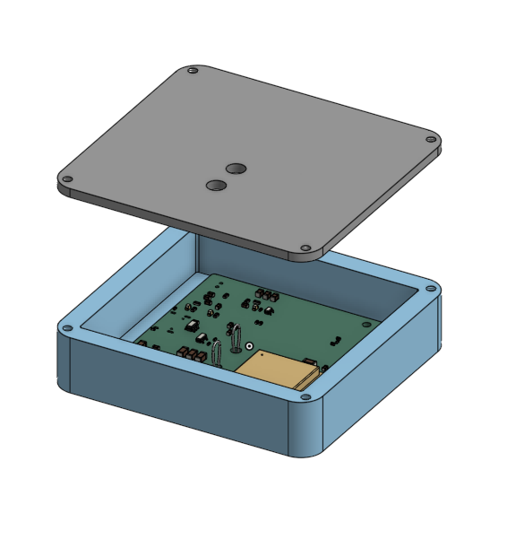
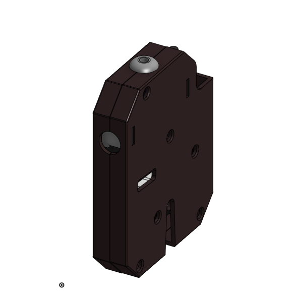

# Wireless bike lock

A wireless bike lock focused on being able to be used wirelessly.

Onshape link: https://cad.onshape.com/documents/6c2c18833c9d8444570c43c7/w/6a4bb112d0b0db7159f785b0/e/d206a90808809049c3ae2997?renderMode=0&uiState=6a67dae82bed96ba51b4ef59

This is the PCB in it's enclosure. I"m building this into an existing bike lock framework, so all I need to do is create the bike lock pcb and the padlock. 

This is the padlock with the latching solenoid

## Flashing the firmware

Firmware lives in `firmware/wireslesslock_controller/`.

1. In Arduino IDE, grab the ESP32 board package: Boards Manager → search "esp32".
2. Plug the board in over USB, then pick it under Tools → Board and Port.
3. Open the `.ino` file and hit Upload.

If it sticks on "Connecting...", hold BOOT, tap EN/RST, then let go of BOOT — that usually does it. "Done uploading" means it's already running.

Many thanks to the people that helped me make this